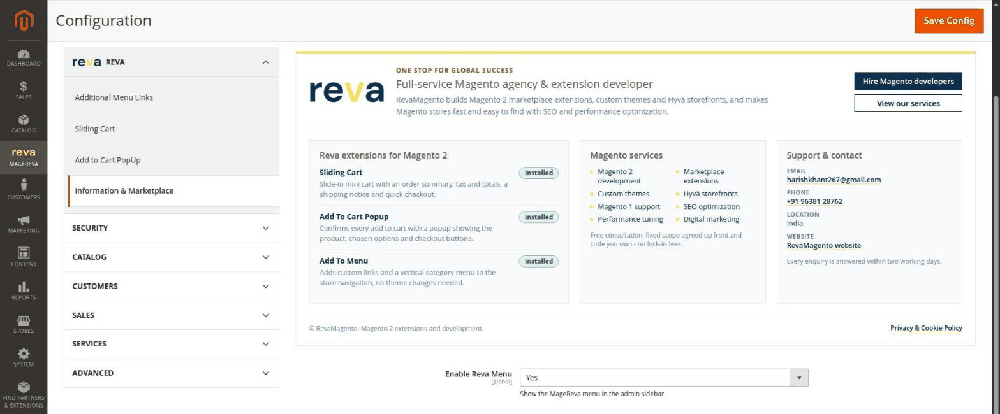

# Reva Core for Magento 2

[](https://business.adobe.com/products/magento/magento-commerce.html)
[](https://www.php.net/supported-versions.php)
[](LICENSE.txt)

**Reva Core** (`Reva_Core`) is the shared base module for all [RevaMagento](https://revacloudflare.harishkhant267.workers.dev/)
extensions. It adds the **MageReva** admin menu, the **Reva** configuration tab and an
**Information & Marketplace** page, so every Reva extension is managed from one place.

You normally get it automatically as a dependency of a Reva extension.



## Features

- **MageReva admin menu** - one sidebar menu with links to the settings of every installed Reva extension.
  The menu is highlighted while you are on a Reva settings page.
- **Reva configuration tab** - all Reva settings grouped under *Stores > Configuration > Reva*.
- **Information & Marketplace page** - shows which Reva extensions are installed, the services RevaMagento
  offers, and support contacts.
- **Admin permissions (ACL)** - control who can see the MageReva menu and the Information page per admin role.
- **Color picker field** - reusable admin color picker for Reva extension settings.

## Reva extensions

| Extension | What it does |
|---|---|
| **Sliding Cart** | Slide-in mini cart with an order summary, tax and totals, a shipping notice and quick checkout. |
| **Add To Cart Popup** | Confirms every add to cart with a popup showing the product, chosen options and checkout buttons. |
| **Add To Menu** | Adds custom links and a vertical category menu to the store navigation, no theme changes needed. |

## Requirements

- Magento Open Source or Adobe Commerce **2.4.4 - 2.4.9**
- PHP **8.1 - 8.5**

## Installation

Run all commands from the Magento root folder.

### Option 1: Composer (recommended)

Install from the Adobe Commerce Marketplace (`repo.magento.com`, using your Marketplace access keys):

```bash
composer require magereva/module-core
```

Or install straight from this GitHub repository:

```bash
composer config repositories.reva-core vcs https://github.com/harishkhant/module-core
composer require magereva/module-core
```

Then enable the module:

```bash
php bin/magento module:enable Reva_Core
php bin/magento setup:upgrade
php bin/magento cache:flush
```

### Option 2: Manual install

1. Download a [tagged version](https://github.com/harishkhant/module-core/tags), or the
   [main branch as a ZIP](https://github.com/harishkhant/module-core/archive/refs/heads/main.zip).
2. Extract it to `app/code/Reva/Core` (create the folders if they do not exist), so that
   `app/code/Reva/Core/registration.php` exists.
3. Enable the module:

```bash
php bin/magento module:enable Reva_Core
php bin/magento setup:upgrade
php bin/magento cache:flush
```

### Production mode

If your store runs in production mode, also compile and deploy static content after `setup:upgrade`:

```bash
php bin/magento setup:di:compile
php bin/magento setup:static-content:deploy -f
php bin/magento cache:flush
```

## Upgrade

```bash
composer update magereva/module-core
php bin/magento setup:upgrade
php bin/magento cache:flush
```

In production mode, run the [production mode](#production-mode) commands as well.

## Configuration

Go to **Stores > Configuration > Reva > Information & Marketplace**.

| Setting | Default | Description |
|---|---|---|
| Enable Reva Menu | Yes | Shows the MageReva menu in the admin sidebar. |

To let a restricted admin role use Reva, open **System > Permissions > User Roles**, edit the role, and under
*Role Resources* tick **MageReva** and, under *Stores > Settings > Configuration*,
**Reva Information & Marketplace**.

## Uninstall

Uninstall the Reva extensions that depend on Reva Core first, then:

```bash
php bin/magento module:disable Reva_Core
composer remove magereva/module-core
php bin/magento setup:upgrade
php bin/magento cache:flush
```

## Changelog

See [CHANGELOG.md](CHANGELOG.md).

## Support

- Website: [RevaMagento - Magento agency and extension developer](https://revacloudflare.harishkhant267.workers.dev/)
- Email: [harishkhant267@gmail.com](mailto:harishkhant267@gmail.com)
- Bugs and feature requests: [GitHub issues](https://github.com/harishkhant/module-core/issues)

## License

Licensed under the [Open Software License 3.0](LICENSE.txt) (OSL-3.0) and the
[Academic Free License 3.0](LICENSE_AFL.txt) (AFL-3.0).

&copy; RevaMagento
